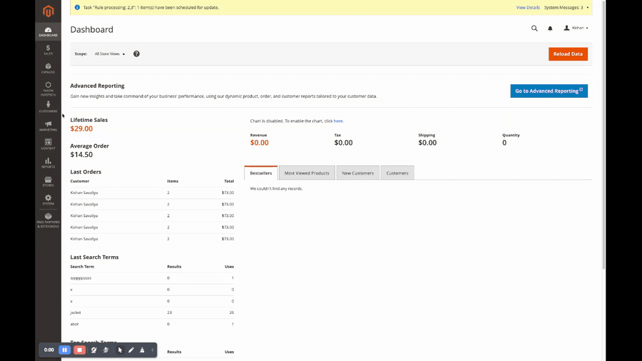
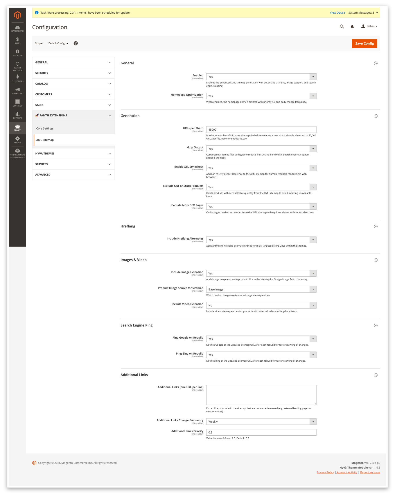
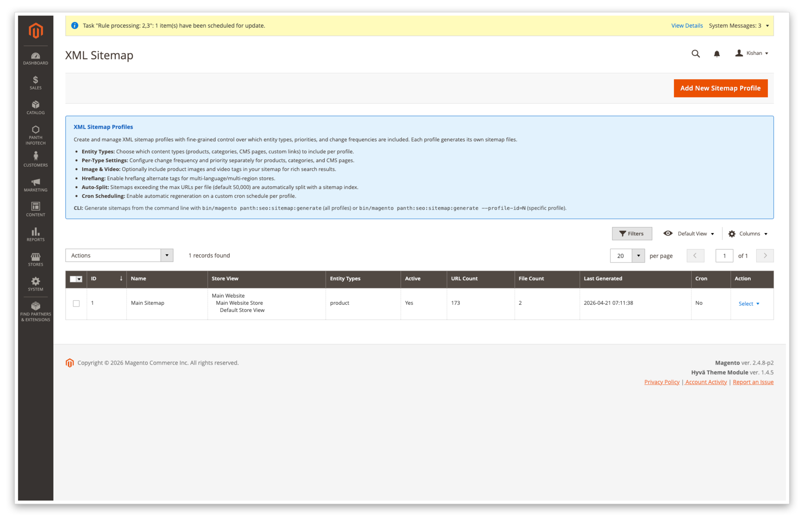
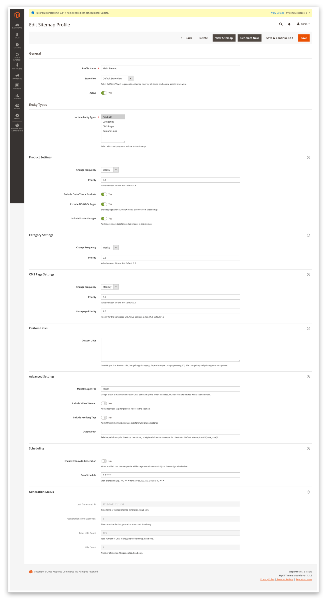
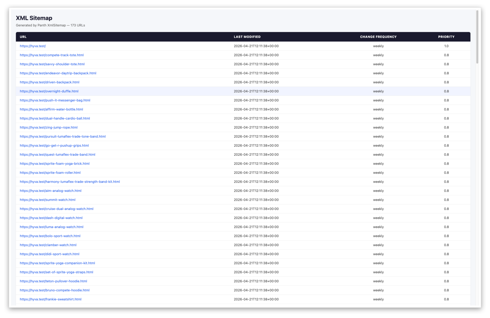

<!-- SEO Meta -->
<!--
  Title: Magento 2 XML Sitemap Extension with Sharding, Hreflang, Image & Video Tags | Hyva + Luma | Panth Infotech
  Description: Panth XML Sitemap replaces the native Magento 2 sitemap pipeline with a sharded, delta-tracked generator. Per-store profiles, seven entity contributors (product, category, CMS, blog, landing page, video, additional links), hreflang alternate tags, image and video sitemap tags, auto-split at a configurable threshold, gzip compression, XSL stylesheet, Google and Bing ping on write, async AMQP shard queue, cron scheduling, and a CLI generator. Hyva and Luma compatible.
  Keywords: magento 2 xml sitemap, magento 2 sitemap extension, magento sharded sitemap, magento hreflang sitemap, magento image sitemap, magento video sitemap, magento sitemap gzip, magento sitemap ping, magento sitemap cron, magento sitemap cli, magento sitemap generator, magento delta sitemap, hyva xml sitemap, luma xml sitemap, panth xml sitemap
  Author: Kishan Savaliya (Panth Infotech)
  Canonical: https://kishansavaliya.com/magento-2-xml-sitemap.html
-->

# Magento 2 XML Sitemap Extension: Sharding, Hreflang, Image & Video Tags (Hyva + Luma)

[](https://magento.com)
[](https://php.net)
[](https://www.hyva.io)
[](https://kishansavaliya.com/magento-2-xml-sitemap.html)
[](https://packagist.org/packages/mage2kishan/module-xml-sitemap)
[](https://www.upwork.com/freelancers/~016dd1767321100e21)
[](https://kishansavaliya.com)

> **A complete XML sitemap replacement for Magento 2.** Panth XML Sitemap adds per-store sitemap profiles, seven entity contributors, hreflang alternate tags, image and video tags, automatic shard splitting, gzip compression, search-engine ping, delta tracking, an async queue, a daily cron, and a CLI command. Works identically on **Hyva** and **Luma**.

**Product page:** [kishansavaliya.com/magento-2-xml-sitemap.html](https://kishansavaliya.com/magento-2-xml-sitemap.html)

---

## Quick Answer

**What is Panth XML Sitemap?** It is a Magento 2 sitemap extension that replaces the native single-blob sitemap pipeline with a sharded, delta-tracked generator that handles hreflang, images, video, gzip, and search-engine ping out of the box.

**What does it add to my store?**

- **Per-store sitemap profiles** so each store view can have its own contributor list, shard size, gzip setting, and cron schedule.
- **Seven entity contributors**: product, category, CMS page, landing page, blog, video, and additional links.
- **Hreflang alternate tags** for multi-language stores, added per URL inside each shard.
- **Image and video sitemap tags** so Google Image Search and video results can index your media.
- **Auto-sharding** that splits files at a configurable URL cap and closes early if a shard would exceed 45 MB.
- **Delta tracking** so only changed entities regenerate on each cron run.
- **Google and Bing ping** after every successful write.
- **A CLI command** for CI pipelines and manual rebuilds.

**Which themes are supported?** Both **Hyva** and **Luma**. The sitemap is a backend-only pipeline; there is no frontend JavaScript, so it works with any theme.

**What does it need?** Magento 2.4.4 to 2.4.8, PHP 8.1 to 8.4, and the free `mage2kishan/module-core` package.

---

## Need Custom Magento 2 Development?

> **Get a free quote for your project in 24 hours** for custom modules, Hyva themes, performance work, M1 to M2 migrations, and Adobe Commerce Cloud.

<p align="center">
  <a href="https://kishansavaliya.com/get-quote">
    
  </a>
</p>

<table>
<tr>
<td width="50%" align="center">

### Kishan Savaliya
**Top Rated Plus on Upwork**

[](https://www.upwork.com/freelancers/~016dd1767321100e21)

100% Job Success - 10+ Years Magento Experience
Adobe Certified - Hyva Specialist

</td>
<td width="50%" align="center">

### Panth Infotech Agency
**Magento Development Team**

[](https://www.upwork.com/agencies/1881421506131960778/)

Custom Modules - Theme Design - Migrations
Performance - SEO - Adobe Commerce Cloud

</td>
</tr>
</table>

**Visit our website:** [kishansavaliya.com](https://kishansavaliya.com) &nbsp;|&nbsp; **Get a quote:** [kishansavaliya.com/get-quote](https://kishansavaliya.com/get-quote)

---

## Table of Contents

- [Who Is It For](#who-is-it-for)
- [Key Features](#key-features)
- [Screenshots](#screenshots)
- [Compatibility](#compatibility)
- [Installation](#installation)
- [Configuration](#configuration)
- [Managing Sitemap Profiles](#managing-sitemap-profiles)
- [How It Works](#how-it-works)
- [CLI](#cli)
- [Cron](#cron)
- [FAQ](#faq)
- [Support](#support)
- [About Panth Infotech](#about-panth-infotech)
- [Quick Links](#quick-links)

---

## Who Is It For

- **Stores with large catalogs** where Google's 50,000 URL and 50 MB per-file limits mean the native sitemap silently drops URLs. Panth XML Sitemap splits into as many shards as needed.
- **Multi-language stores** that need `hreflang` alternate links inside every sitemap entry so search engines serve the right language version to each audience.
- **Stores with rich media** that want product images and videos indexed by Google Image and Video Search.
- **Merchants who want fast nightly rebuilds** because the delta tracker skips shards whose source entities have not changed since the last run.
- **Development teams** that need a CLI command to regenerate sitemaps in CI pipelines after deploys.

---

## Key Features

### Per-Store Sitemap Profiles
- **One profile per store view** with its own contributor list, shard size, gzip flag, hreflang flag, cron schedule, and active toggle.
- **Profile grid in admin** at Admin - Panth Infotech - XML Sitemap - Sitemap Profiles with inline Edit, Generate Now, View Sitemap, and Delete actions.
- **Mass actions**: Enable, Disable, Regenerate Now, and Delete for multiple profiles at once.
- **Base URL override** so CDN domains or alternate apex hosts are handled correctly per store.

### Seven Entity Contributors
- **Product contributor** walks enabled, visible products, reads canonical URLs from `url_rewrite`, and emits `<lastmod>`, `<changefreq>`, and `<priority>` per URL.
- **Category contributor** walks active categories at the store's root, respecting the store's root category.
- **CMS page contributor** includes all active CMS pages, excluding the homepage, no-route, cookie notice, and any admin-configured extra identifiers.
- **Landing page contributor** auto-enabled when Panth Landing Pages module is present; self-disables otherwise.
- **Blog contributor** auto-detects supported third-party blog modules and self-disables when none are installed.
- **Video contributor** emits `<video:video>` blocks for products with external video media gallery items.
- **Additional links contributor** reads a free-form textarea of custom URLs (one per line) for campaign pages or any URL that does not live in a content table.

### Hreflang, Image & Video Tags
- **Hreflang alternate tags** add `<xhtml:link rel="alternate" hreflang="xx-YY">` entries per URL when the store has two or more locale codes, including `x-default`.
- **Image tags** add `<image:image>` blocks with image URL, title, and caption for every gallery image on a product URL.
- **Video tags** add `<video:video>` blocks (title, description, content URL, thumbnail, duration) for products with associated video media.
- **Configurable image source**: choose base image, small image, or thumbnail for sitemap entries.

### Auto-Sharding and Gzip
- **Auto-split at a configurable URL cap** (default 45,000, well under Google's 50,000 hard limit). Shards are named `sitemap-1.xml`, `sitemap-2.xml`, and so on.
- **Early close at 45 MB uncompressed** to stay under the 50 MB per-file cap.
- **Gzip compression** writes shards as `.xml.gz` with `Content-Encoding: gzip`. A typical catalog compresses about 10:1, so a 45 MB shard ships as roughly 4.5 MB.
- **XSL stylesheet** can be injected into every shard so the sitemap renders as a human-readable table in a browser while remaining a valid XML file for crawlers.

### Search-Engine Ping and Delta Tracking
- **Ping Google and Bing** after every successful write. Each engine can be enabled or disabled independently per profile.
- **Delta tracker** records `last_generated_at` per entity in `panth_seo_sitemap_shard`. The next cron run skips shards whose source entities have not changed. Typical nightly time drops from 90 seconds to 5 seconds on a 50k-product store.
- **Force flag** on the CLI bypasses the delta tracker for a full rebuild when needed.

### Async Queue, Cron, and CLI
- **Async AMQP shard queue** dispatches each shard to the `panth_xml_sitemap.shard` topic when enabled; a worker pool builds shards in parallel.
- **Nightly cron** at `0 2 * * *` by default; each profile can override with its own cron expression.
- **CLI command** `panth:seo:sitemap:generate` for manual and CI-driven runs, with `--profile-id` and `--force` flags.
- **Frontend endpoint** `/panth-sitemap.xml` served by the module controller via a `url_rewrite` row installed at setup time.

### Exclude Flags
- **Exclude out-of-stock products** to avoid indexing unavailable items.
- **Exclude NOINDEX pages** to keep the sitemap consistent with your robots meta directives.
- **Per-profile excluded CMS identifiers** textarea to drop specific CMS pages from the CMS shard.

---

## Screenshots

### Live walkthrough

End-to-end admin flow: open the XML Sitemap config, toggle fields, edit the default profile, flip entity types and priorities, run Generate Now, and click View Sitemap.



### System configuration

**Stores - Configuration - Panth Extensions - XML Sitemap** with six collapsible groups (General, Generation, Hreflang, Images & Video, Search Engine Ping, Additional Links).



### Sitemap Profiles grid

One row per profile with columns for ID, Name, Store View, Entity Types, Active, URL Count, File Count, Last Generated, and per-row actions.



### Edit Sitemap Profile form

Eight collapsible sections covering every profile setting, with a read-only Generation Status block populated after each run.



### XSL rendered sitemap

The XSL stylesheet renders a human-readable table in the browser while the response stays valid XML for crawlers.



---

## Compatibility

| Requirement | Versions Supported |
|---|---|
| Magento Open Source | 2.4.4, 2.4.5, 2.4.6, 2.4.7, 2.4.8 |
| Adobe Commerce | 2.4.4, 2.4.5, 2.4.6, 2.4.7, 2.4.8 |
| Adobe Commerce Cloud | 2.4.4 to 2.4.8 |
| PHP | 8.1.x, 8.2.x, 8.3.x, 8.4.x |
| Hyva Theme | 1.0+ (compatible; no frontend JS changes) |
| Luma Theme | Native support |
| Required Dependency | `mage2kishan/module-core` (free) |

---

## Installation

### Composer Installation (Recommended)

```bash
composer require mage2kishan/module-xml-sitemap
bin/magento module:enable Panth_Core Panth_XmlSitemap
bin/magento setup:upgrade
bin/magento setup:di:compile
bin/magento setup:static-content:deploy -f
bin/magento cache:flush
```

### Manual Installation via ZIP

1. Download the latest release from [Packagist](https://packagist.org/packages/mage2kishan/module-xml-sitemap) or from the [product page](https://kishansavaliya.com/magento-2-xml-sitemap.html).
2. Extract it to `app/code/Panth/XmlSitemap/` in your Magento install.
3. Make sure `Panth_Core` is installed too (required dependency).
4. Run the commands above starting from `bin/magento module:enable`.

### Verify Installation

```bash
bin/magento module:status Panth_XmlSitemap
# Expected: Module is enabled
```

After install, open:
```
Admin - Panth Infotech - XML Sitemap - Sitemap Profiles
```

---

## Configuration

Go to **Admin - Panth Infotech - XML Sitemap - Configuration** (or **Stores - Configuration - Panth Extensions - XML Sitemap**).

Every setting resolves at store-view scope, so each store can have a different configuration.

### General

| Setting | Group | Default | Description |
|---|---|---|---|
| Enabled | General | Yes | Master toggle. When No, the frontend controller returns 404 and the cron is a no-op. |
| Homepage Optimization | General | Yes | Emits the homepage URL with priority 1.0 and daily change frequency. |

### Generation

| Setting | Group | Default | Description |
|---|---|---|---|
| URLs per Shard | Generation | 45000 | Maximum number of URLs per sitemap file before a new shard is opened. Range: 1000 to 50000. |
| Gzip Output | Generation | Yes | Writes shards as `.xml.gz` with `Content-Encoding: gzip`. |
| Enable XSL Stylesheet | Generation | No | Adds an `<?xml-stylesheet?>` processing instruction so the sitemap renders as a table in browsers. |
| Exclude Out-of-Stock Products | Generation | No | Omits products with zero saleable quantity. |
| Exclude NOINDEX Pages | Generation | No | Omits pages marked as noindex, keeping the sitemap consistent with robots directives. |

### Hreflang

| Setting | Group | Default | Description |
|---|---|---|---|
| Include Hreflang Alternates | Hreflang | Yes | Adds `<xhtml:link rel="alternate" hreflang="xx-YY">` entries per URL for multi-language stores. |

### Images & Video

| Setting | Group | Default | Description |
|---|---|---|---|
| Include Image Extension | Images & Video | Yes | Adds `<image:image>` blocks per product URL for Google Image Search indexing. |
| Product Image Source for Sitemap | Images & Video | base_image | Which product image role to use in image sitemap entries (base image, small image, or thumbnail). |
| Include Video Extension | Images & Video | No | Adds `<video:video>` blocks per product URL that has associated video media. |

### Search Engine Ping

| Setting | Group | Default | Description |
|---|---|---|---|
| Ping Google on Rebuild | Search Engine Ping | Yes | POSTs to Google's ping endpoint after each successful sitemap write. |
| Ping Bing on Rebuild | Search Engine Ping | Yes | POSTs to Bing's ping endpoint after each successful sitemap write. |

### Additional Links

| Setting | Group | Default | Description |
|---|---|---|---|
| Additional Links (one URL per line) | Additional Links | (empty) | Extra URLs to include that are not auto-discovered (campaign pages, custom routes, etc.). |
| Additional Links Change Frequency | Additional Links | weekly | Change frequency emitted for additional link entries. |
| Additional Links Priority | Additional Links | 0.5 | Priority emitted for additional link entries. Range: 0.0 to 1.0. |

---

## Managing Sitemap Profiles

Open **Admin - Panth Infotech - XML Sitemap - Sitemap Profiles**.

Each profile row is scoped to a single store view and carries its own settings for contributor list, shard size, gzip, hreflang, images, video, cron schedule, and active flag.

### Key Profile Fields

| Field | Description |
|---|---|
| Store View | The store view this profile applies to. One profile per store. |
| Base URL | Absolute URL used as the `<loc>` prefix. Defaults to the store's base URL. Override for CDN or custom domains. |
| Max URLs per File | Per-profile override of the global shard cap. Range: 100 to 50000. |
| Include Products | Run the product contributor for this profile. |
| Include Categories | Run the category contributor for this profile. |
| Include CMS Pages | Run the CMS page contributor for this profile. |
| Include Landing Pages | Run the landing page contributor (auto-skipped if Panth Landing Pages is not installed). |
| Include Blog | Run the blog contributor (auto-skipped if no supported blog module is installed). |
| Enable Hreflang | Add hreflang alternate entries per URL. |
| Enable Images | Add `<image:image>` blocks per product URL. |
| Enable Videos | Add `<video:video>` blocks per product URL with video media. |
| Enable Gzip | Write shards as `.xml.gz`. |
| Ping Google | POST to Google's ping endpoint on successful write. |
| Ping Bing | POST to Bing's ping endpoint on successful write. |
| Enable Queue | Dispatch each shard to the AMQP topic for parallel worker-based generation. |
| Enable Delta | Skip shards whose source entities have not changed since the last run. |
| Cron Schedule | Standard cron expression for this profile (default `0 2 * * *`). |
| Active | Inactive profiles are skipped by cron and CLI. |

---

## How It Works

1. **`Setup\Patch\Data\InstallSitemapRewrite`** installs a `url_rewrite` row that maps `/panth-sitemap.xml` to the module controller at setup time. No manual DB work is needed.
2. A **Sitemap Profile** defines which entities to include, how to split shards, and when to regenerate. Each profile is scoped to one store view.
3. **`Model\Sitemap\Builder`** is the orchestrator. It resolves the store scope, iterates registered contributors in a fixed order, pipes each URL through `ShardWriter`, closes shards at the configured threshold, writes the top-level `sitemap_index.xml`, saves run metadata to the delta table, and pings search engines on success.
4. **Contributors** are plugged in through `di.xml` and can be enabled or disabled per profile. Each contributor queries its entity table, resolves canonical URLs from `url_rewrite`, and yields URL objects with `<lastmod>`, `<changefreq>`, `<priority>`, plus optional hreflang, image, and video blocks.
5. **`ShardWriter`** writes one XML file at a time, closing and opening a new shard when the URL count reaches the cap or the uncompressed size would exceed 45 MB.
6. **`DeltaTracker`** records a `last_generated_at` timestamp per entity type after each successful run. The next run compares these timestamps and skips whole contributor shards that have not changed.
7. **`SearchEnginePinger`** POSTs to Google and Bing after a successful build with a 5-second timeout and one retry on server errors.
8. **`Cron\Rebuild`** fires on the configured schedule. For async-enabled profiles it dispatches shard jobs to the AMQP queue; for synchronous profiles it calls `Builder::generate()` directly.
9. **`Console\GenerateCommand`** exposes `panth:seo:sitemap:generate` for manual and CI-driven runs.

### Sitemap index shape

```xml
<?xml version="1.0" encoding="UTF-8"?>
<sitemapindex xmlns="http://www.sitemaps.org/schemas/sitemap/0.9">
  <sitemap>
    <loc>https://your-store.test/panth-sitemap-products-1.xml.gz</loc>
    <lastmod>2026-04-21T02:00:05+00:00</lastmod>
  </sitemap>
  <sitemap>
    <loc>https://your-store.test/panth-sitemap-categories-1.xml.gz</loc>
    <lastmod>2026-04-21T02:00:08+00:00</lastmod>
  </sitemap>
</sitemapindex>
```

### Individual shard shape

```xml
<?xml version="1.0" encoding="UTF-8"?>
<urlset xmlns="http://www.sitemaps.org/schemas/sitemap/0.9"
        xmlns:xhtml="http://www.w3.org/1999/xhtml"
        xmlns:image="http://www.google.com/schemas/sitemap-image/1.1"
        xmlns:video="http://www.google.com/schemas/sitemap-video/1.1">
  <url>
    <loc>https://your-store.test/example-product.html</loc>
    <lastmod>2026-04-20T13:22:14+00:00</lastmod>
    <changefreq>daily</changefreq>
    <priority>0.8</priority>
    <xhtml:link rel="alternate" hreflang="en-US" href="https://your-store.test/example-product.html"/>
    <xhtml:link rel="alternate" hreflang="fr-FR" href="https://fr.your-store.test/exemple-produit.html"/>
    <xhtml:link rel="alternate" hreflang="x-default" href="https://your-store.test/example-product.html"/>
    <image:image>
      <image:loc>https://your-store.test/media/catalog/product/e/x/example.jpg</image:loc>
      <image:title>Example Product</image:title>
    </image:image>
  </url>
</urlset>
```

---

## CLI

```bash
# Generate every active profile
bin/magento panth:seo:sitemap:generate

# Generate a single profile by ID
bin/magento panth:seo:sitemap:generate --profile-id=3

# Force a full rebuild, bypassing the delta tracker
bin/magento panth:seo:sitemap:generate --profile-id=3 --force

# Quiet mode (suppress per-contributor progress, emit only the final summary)
bin/magento panth:seo:sitemap:generate --quiet
```

Exit codes: `0` on success, `1` on fatal error, `2` on partial success (one contributor failed, others completed).

---

## Cron

The default cron job runs at `0 2 * * *` (02:00 daily):

```bash
bin/magento cron:list | grep panth_xml_sitemap
# panth_xml_sitemap_rebuild   default   0 2 * * *
```

Each profile can override the schedule with its own cron expression. The cron runner only dispatches a profile when its schedule matches the current run window and its Active flag is Yes.

When any profile has the async queue enabled, start the consumer as a long-running process:

```bash
bin/magento queue:consumers:start panth_xml_sitemap_consumer --single-thread
```

---

## FAQ

### Does this replace Magento's native sitemap?

No. Panth XML Sitemap uses its own URL `/panth-sitemap.xml` (served by the module controller via a `url_rewrite` row), so Magento's native sitemap at its existing path is unaffected. You can run both during a transition period and then remove the native one when ready.

### Why would I use this instead of the native sitemap?

The native Magento sitemap is a single blob written to disk on every cron run, re-crawling every product each time. It has no hreflang, no sharding (so large catalogs silently drop URLs past 50,000), no image or video tags, no incremental regeneration, and no ping-on-write. Panth XML Sitemap solves all of those gaps.

### Will it work on my Hyva store?

Yes. The sitemap pipeline is entirely backend (PHP). There is no frontend JavaScript, so it works with Hyva, Luma, and any custom theme.

### How do I see if the sitemap was generated correctly?

Open **Admin - Panth Infotech - XML Sitemap - Sitemap Profiles**, find your profile row, and click "View Sitemap". You can also visit `/panth-sitemap.xml` directly in the browser and the XSL stylesheet (if enabled) renders it as a readable table.

### Hreflang tags are not appearing in the shards. Why?

Hreflang only fires when the store has two or more store views with different locale codes. A single-locale store has no alternates to emit, so the contributor is a no-op. Confirm you have at least two locale codes configured under Stores - Store Views.

### How does delta tracking work?

After each successful run the module saves a `last_generated_at` timestamp per entity type in `panth_seo_sitemap_shard`. On the next cron run, the builder compares those timestamps against the entity tables and skips contributors whose data has not changed. Run the CLI with `--force` to bypass delta tracking and do a full rebuild.

### The sitemap returns a 404. How do I fix it?

Run `bin/magento setup:upgrade` to have the `InstallSitemapRewrite` (or `RefreshSitemapRewrite`) patch install or repair the `url_rewrite` row. Then flush the config and full-page cache. Also check that the module is enabled and that the master toggle in configuration is set to Yes.

### Can I add custom URLs that are not product, category, or CMS pages?

Yes. Use the Additional Links textarea in configuration (**Stores - Configuration - Panth Extensions - XML Sitemap - Additional Links**) or add a Custom Links section to a profile. Enter one URL per line.

### Does it support async generation for large stores?

Yes. Enable the queue flag on any profile and start the consumer `bin/magento queue:consumers:start panth_xml_sitemap_consumer`. Each shard is dispatched to the `panth_xml_sitemap.shard` AMQP topic and built in parallel.

---

## Support

| Channel | Contact |
|---|---|
| Product Page | [kishansavaliya.com/magento-2-xml-sitemap.html](https://kishansavaliya.com/magento-2-xml-sitemap.html) |
| Email | kishansavaliyakb@gmail.com |
| Website | [kishansavaliya.com](https://kishansavaliya.com) |
| WhatsApp | +91 84012 70422 |
| GitHub Issues | [github.com/mage2sk/module-xml-sitemap/issues](https://github.com/mage2sk/module-xml-sitemap/issues) |
| Upwork (Top Rated Plus) | [Hire Kishan Savaliya](https://www.upwork.com/freelancers/~016dd1767321100e21) |
| Upwork Agency | [Panth Infotech](https://www.upwork.com/agencies/1881421506131960778/) |

Response time: 1-2 business days.

### Need Custom Magento Development?

Looking for **custom Magento module development**, **Hyva theme work**, **store migrations**, or **performance tuning**? Get a free quote in 24 hours:

<p align="center">
  <a href="https://kishansavaliya.com/get-quote">
    
  </a>
</p>

<p align="center">
  <a href="https://www.upwork.com/freelancers/~016dd1767321100e21">
    
  </a>
  &nbsp;&nbsp;
  <a href="https://www.upwork.com/agencies/1881421506131960778/">
    
  </a>
  &nbsp;&nbsp;
  <a href="https://kishansavaliya.com/magento-2-xml-sitemap.html">
    
  </a>
</p>

---

## About Panth Infotech

Built and maintained by **Kishan Savaliya** ([kishansavaliya.com](https://kishansavaliya.com)), a **Top Rated Plus** Magento developer on Upwork with 10+ years of eCommerce experience.

**Panth Infotech** is a Magento 2 development agency that builds high quality, security focused extensions and themes for both Hyva and Luma storefronts. The extension suite covers SEO, performance, checkout, product presentation, customer engagement, and store management, with each module built to MEQP standards and tested across Magento 2.4.4 to 2.4.8.

Browse the full extension catalog on our [Magento extensions page](https://kishansavaliya.com/magento-extensions.html) or on [Packagist](https://packagist.org/packages/mage2kishan/).

---

## Quick Links

| Resource | Link |
|---|---|
| **Product Page** | [magento-2-xml-sitemap.html](https://kishansavaliya.com/magento-2-xml-sitemap.html) |
| **Packagist** | [mage2kishan/module-xml-sitemap](https://packagist.org/packages/mage2kishan/module-xml-sitemap) |
| **GitHub** | [mage2sk/module-xml-sitemap](https://github.com/mage2sk/module-xml-sitemap) |
| **Website** | [kishansavaliya.com](https://kishansavaliya.com) |
| **Free Quote** | [kishansavaliya.com/get-quote](https://kishansavaliya.com/get-quote) |
| **Upwork (Top Rated Plus)** | [Hire Kishan Savaliya](https://www.upwork.com/freelancers/~016dd1767321100e21) |
| **Upwork Agency** | [Panth Infotech](https://www.upwork.com/agencies/1881421506131960778/) |
| **Email** | kishansavaliyakb@gmail.com |
| **WhatsApp** | +91 84012 70422 |

---

<p align="center">
  <strong>Ready to give search engines a complete, well-structured sitemap?</strong><br/>
  <a href="https://kishansavaliya.com/magento-2-xml-sitemap.html">
    
  </a>
</p>

---

**SEO Keywords:** magento 2 xml sitemap, magento 2 sitemap extension, magento 2 sitemap module, magento sharded sitemap, magento sitemap sharding, magento hreflang sitemap, magento image sitemap, magento image tags sitemap, magento video sitemap, magento video tags sitemap, magento sitemap gzip, magento sitemap compression, magento sitemap search engine ping, magento sitemap cron, magento sitemap cli, magento sitemap generator, magento delta sitemap, magento incremental sitemap, hyva xml sitemap, hyva sitemap extension, luma xml sitemap, magento 2 sitemap index, magento 2 multi-store sitemap, magento 2 sitemap profile, magento 2.4.8 sitemap, php 8.4 sitemap, mage2kishan xml sitemap, panth xml sitemap, panth infotech, hire magento developer, top rated plus upwork, kishan savaliya magento, custom magento development
