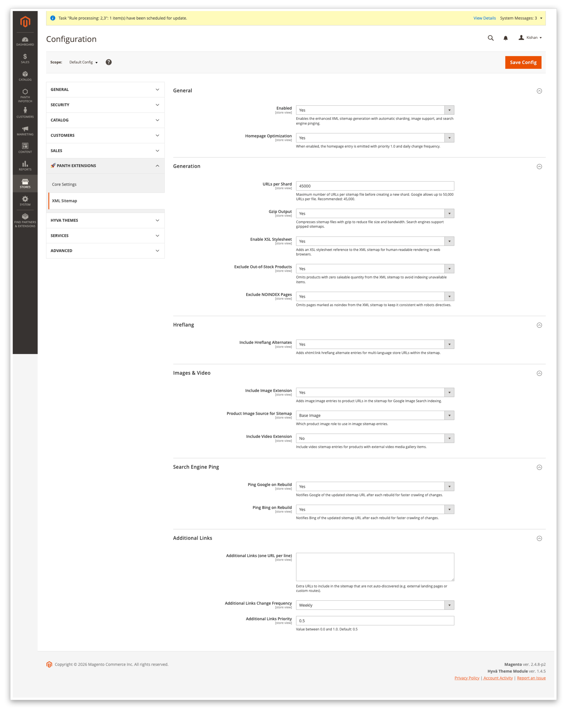
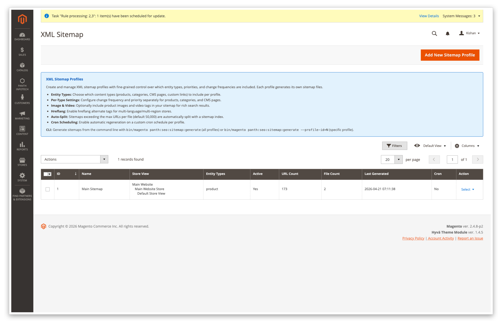
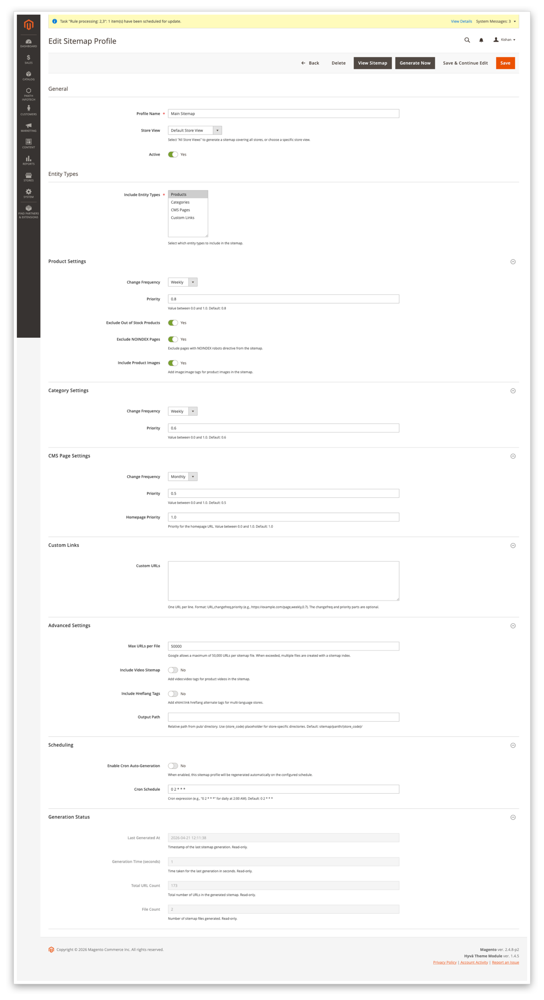
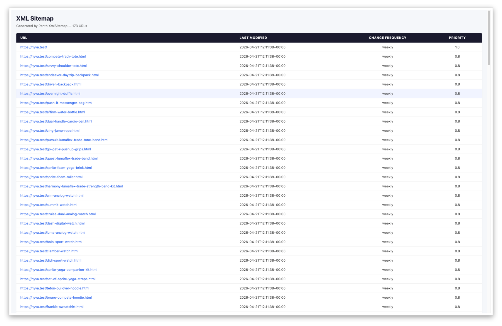
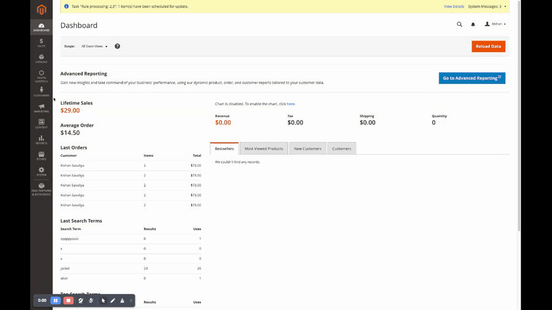

# Magento 2 XML Sitemap

Panth XML Sitemap (`Panth_XmlSitemap`) writes XML sitemap files for Magento 2 store views. Sitemaps are defined as profiles in the admin. Each profile builds one file set per store view: separate files per entity type (products, categories, CMS pages, blog, custom links and others), split at a URL limit, plus a sitemap index file. It does not use or change Magento's own `Magento_Sitemap` sitemap records. It keeps its own profile table, output folder and a separate dynamic URL, `/panth-sitemap.xml`. It is meant for merchants and developers who want per-store sitemap files built from `url_rewrite` data, with optional product image and video tags, generated from the admin, cron or the command line.

Product page: [Magento 2 XML Sitemap](https://kishansavaliya.com/magento-2-xml-sitemap.html)

## Features

- Sitemap profiles managed in an admin grid and form. Each profile has a name, a store view, an active flag, a list of entity types, a change frequency and priority per type, custom links, a max URLs per file value, an output path and a cron flag.
- Keyword search on the Sitemap Profiles grid (name, output path, entity types).
- Contributors registered in `etc/di.xml`, run in this order: products, categories, CMS pages, landing pages, blog, product videos, testimonials, FAQs, dynamic forms, additional links.
- Products: enabled products that are visible in catalog or in catalog and search, assigned to the store's website, taken from auto-generated `url_rewrite` rows with no redirect. `lastmod` comes from the product's `updated_at` value.
- Categories: active categories under the store's root category, taken from `url_rewrite`.
- CMS pages: active pages assigned to the store or to all stores. The store's home page and `no-route` are skipped, and so are the identifiers listed in the profile's "Excluded CMS Identifiers" field.
- Product images: one `image:image` entry per product URL, using the image role picked in configuration (base image, small image or thumbnail).
- Product videos: `video:video` entries for products that have external video items in the media gallery (off by default).
- Blog posts: read from `mage2kishan/module-blog` tables when they exist, otherwise from Magefan Blog or Mageplaza Blog when one of those modules is enabled (see [Blog integration](#blog-integration)).
- Testimonials, FAQs and dynamic forms: read from the tables of the matching Panth modules. Each contributor returns no URLs when its tables are not installed.
- Additional links: a list of absolute URLs entered in configuration.
- Automatic splitting: a new file starts when the profile's URL limit (at most 50,000) is reached or when a file reaches 50 MB. All files are listed in one sitemap index.
- Optional XSL stylesheet (`sitemap-style.xsl`) written next to the files so browsers show the sitemap as a table.
- Optional exclusion of out-of-stock products and of pages marked NOINDEX.
- `changefreq` and `priority` elements from the profile and configuration values (can be turned off).
- Optional gzip output: the files listed in the index are written as `.xml.gz`.
- Optional hreflang alternates from `mage2kishan/module-hreflang` or from your own resolver.
- Console command `panth:seo:sitemap:generate`, a cron job that follows each profile's own Cron Schedule, and "Generate Now" actions in the admin.

Screenshots:











## Compatibility

| Component | Supported versions |
|---|---|
| Magento Open Source | 2.4.4 to 2.4.8 |
| Adobe Commerce | 2.4.4 to 2.4.8 |
| PHP | 8.1, 8.2, 8.3, 8.4 (`~8.1.0\|\|~8.2.0\|\|~8.3.0\|\|~8.4.0`) |

Magento constraints in `composer.json`: `magento/framework ^103.0`, `magento/module-store ^101.1`, `magento/module-backend ^102.0`, `magento/module-ui ^101.2`, `magento/module-catalog ^104.0`, `magento/module-cms ^104.0`, `magento/module-url-rewrite ^102.0`, `magento/module-config ^101.2`, `magento/module-cron ^100.4`, `magento/module-eav ^102.1`, `magento/module-sitemap ^100.4`.

## Requirements

- `mage2kishan/module-core` (`Panth_Core`) ^1.0. Composer installs it automatically. It provides the "Panth Extensions" configuration tab and the "Panth Infotech" admin menu.
- Magento cron, if you want profiles to be rebuilt automatically.
- Optional (listed under `suggest` in `composer.json`): `mage2kishan/module-blog`, which adds Panth blog posts, categories, tags and authors to the sitemap.

## Installation

```bash
composer require mage2kishan/module-xml-sitemap
bin/magento module:enable Panth_Core Panth_XmlSitemap
bin/magento setup:upgrade
bin/magento setup:di:compile
bin/magento cache:flush
```

`setup:di:compile` is only needed in production mode. The module has no `view/*/web` assets, so no static content deploy is needed.

Check that the module is enabled:

```bash
bin/magento module:status Panth_XmlSitemap
```

`setup:upgrade` does the following:

- creates the `panth_seo_sitemap_profile` table and adds a default profile named "Main Sitemap" (store ID 0, entity types `product,category,cms,custom`, output path `xmlsitemap/{store_code}/`, cron off). A profile with store ID 0 is built for the default store view;
- adds the `in_xml_sitemap` product and category attribute ("Include in XML Sitemap");
- adds a `url_rewrite` row for every store that maps `panth-sitemap.xml` to `xml_sitemap/sitemap/index`.

## Configuration

Admin path: **Stores > Configuration > Panth Extensions > XML Sitemap**. You can also use **Panth Infotech > XML Sitemap > Configuration**.

All fields can be set at default, website and store view scope. Config paths start with `panth_xml_sitemap/`.

### General

| Setting | Default | What it does |
|---|---|---|
| Enabled (`general/enabled`) | Yes | In this version this flag only controls whether the "Exclude from XML Sitemap" toggle is shown on the product and category edit forms. It does not stop generation. |
| Homepage Optimization (`general/homepage_optimization`) | Yes | Adds the store base URL as the first entry of the product contributor. |

### Generation

| Setting | Default | What it does |
|---|---|---|
| URLs per Shard (`generation/shard_size`) | 45000 | URL limit per file for the store-based build that runs when no active profile exists. Validated to the range 1000 to 50000. Profiles use their own "Max URLs per File" value instead. |
| Gzip Output (`generation/gzip`) | No | When Yes, every file listed in the index is written as gzip (`sitemap-products-1.xml.gz` and so on) and the index links to the `.gz` names. The index itself stays plain XML at the same URL. Before 1.2.0 the default was Yes but the setting had no effect, so a store that saved Yes gets `.gz` files after upgrading. |
| Write Change Frequency and Priority (`generation/include_changefreq_priority`) | Yes | Writes the `changefreq` and `priority` values from profiles and Additional Links into each `url` entry, in the generated files and in `/panth-sitemap.xml`. Google ignores both elements; set to No to leave them out. |
| Enable XSL Stylesheet (`generation/xsl_enabled`) | Yes | Writes `sitemap-style.xsl` to the output folder and adds an `xml-stylesheet` instruction to every file. |
| Exclude Out-of-Stock Products (`generation/exclude_out_of_stock`) | Yes | Used by the product contributor in the store-based build and for the dynamic URL when no profile applies. Profiles use their own setting. Keeps only products with stock status "in stock". |
| Exclude NOINDEX Pages (`generation/exclude_noindex`) | Yes | Used by the product contributor in the store-based build and for the dynamic URL when no profile applies. Profiles use their own setting. Skips products whose robots value in the `panth_seo_resolved` table contains `noindex`. |
| Sitemap Index Filename (`generation/index_filename`) | sitemap.xml | File name of the sitemap index. Any path part is removed. The name must end in `.xml` and use only letters, digits, dot, dash and underscore; any other value falls back to `sitemap.xml`. Before 1.1.0 the name was `sitemap_index.xml`. |

### Hreflang

| Setting | Default | What it does |
|---|---|---|
| Include Hreflang Alternates (`hreflang/include_hreflang`) | Yes | Adds `xhtml:link` alternates to product, category and CMS page URLs in the store-based build and in `/panth-sitemap.xml` when no profile applies. Profiles use their own Include Hreflang Tags setting. The alternates come from the bound hreflang resolver, so nothing is written unless Use Panth Hreflang Module is Yes or a developer binds another resolver (see [Developer Notes](#developer-notes)). |
| Use Panth Hreflang Module (`hreflang/use_hreflang_module`) | No | When Yes and `mage2kishan/module-hreflang` is installed, alternates are read from that module. This adds one lookup per URL, so large catalogs build more slowly. |

### Images & Video

| Setting | Default | What it does |
|---|---|---|
| Include Image Extension (`media/include_images`) | Yes | Adds an `image:image` entry to product URLs in the store-based build and for the dynamic URL when no profile applies. Profiles use their own "Include Product Images" setting. |
| Product Image Source for Sitemap (`media/product_image_source`) | Base Image (`base_image`) | Image role used for the image entry: `base_image`, `small_image` or `thumbnail`. Shown only when Include Image Extension is Yes. |
| Include Video Extension (`media/include_video`) | No | Turns on the video contributor, which writes `video:video` entries for products with external video gallery items. |

### Search engine notification

Version 1.2.0 removed the Ping Google and Ping Bing settings and the requests to `google.com/ping` and `bing.com/ping`; both endpoints were retired by the search engines. Submit the sitemap in Google Search Console and Bing Webmaster Tools, or list it in `robots.txt`. Old `panth_xml_sitemap/ping/*` rows in `core_config_data` are no longer read.

### Additional Links

| Setting | Default | What it does |
|---|---|---|
| Additional Links (one URL per line) (`additional/additional_links`) | (empty) | Absolute `http` or `https` URLs added to the sitemap. Invalid lines and duplicates are skipped. |
| Additional Links Change Frequency (`additional/additional_links_changefreq`) | weekly | Change frequency stored with these entries. |
| Additional Links Priority (`additional/additional_links_priority`) | 0.5 | Priority stored with these entries (0.0 to 1.0). |

Each `url` entry contains `loc`, `lastmod`, `changefreq` and `priority` (while Write Change Frequency and Priority is Yes), and image, video or hreflang tags when present.

### Sitemap profiles

Profiles are managed at **Panth Infotech > XML Sitemap > Sitemap Profiles**. The grid shows ID, Name, Store View, Entity Types, Active, URL Count, File Count, Last Generated, Cron and Sitemap URL. Row actions are View Sitemap, Edit, Generate Now and Delete. The only mass action is Delete. Generate Now, Delete and the mass Delete are sent as POST requests. Saving and deleting profiles requires the "Save / Delete Sitemap Profiles" ACL resource (`Panth_XmlSitemap::profiles_save`).

The edit form has these sections:

| Section | Fields |
|---|---|
| General | Profile Name, Store View (one store view per profile), Active |
| Entity Types | Include Entity Types: Products, Categories, CMS Pages, Custom Links, Testimonials (if module installed), FAQs (if module installed), Dynamic Forms (if module installed) |
| Product Settings | Change Frequency, Priority (default 0.8), Exclude Out of Stock Products, Exclude NOINDEX Pages, Include Product Images |
| Category Settings | Change Frequency, Priority (default 0.6) |
| CMS Page Settings | Change Frequency, Priority (default 0.5), Homepage Priority (default 1.0), Excluded CMS Identifiers (default: home, enable-cookies, privacy-policy-cookie-restriction-mode, no-route) |
| Custom Links | Custom URLs, one per line, as `URL,changefreq,priority`. Relative paths are prefixed with the store base URL. |
| Advanced Settings | Max URLs per File (at most 50,000), Include Video Sitemap, Include Hreflang Tags, Output Path |
| Scheduling | Enable Cron Auto-Generation, Cron Schedule |
| Generation Status | Last Generated At, Generation Time (seconds), Total URL Count, File Count (read-only) |

Include Video Sitemap and Include Hreflang Tags control whether a profile's files declare the `video` and `xhtml` namespaces and contain `video:video` and `xhtml:link` entries. Video entries are written only when both Include Video Sitemap on the profile and Include Video Extension in configuration are on. YouTube and Vimeo videos are written as `video:player_loc` embed URLs (`https://www.youtube.com/embed/<id>`, `https://player.vimeo.com/video/<id>`); only direct media file URLs such as `.mp4` go into `video:content_loc`. A video without a thumbnail or title is skipped, and an empty description falls back to the title.

Cron Schedule must be a valid five-field cron expression; the profile cannot be saved otherwise. A blank value is saved as `0 2 * * *`.

How entity types map to contributors: Products also turns on landing pages, and CMS Pages also turns on blog URLs. The video, dynamic form and additional links contributors run whatever entity types are selected. The video contributor still depends on Include Video Extension, and the additional links contributor on the Additional Links field.

## Usage

### Generating sitemaps

- **Admin:** use Generate Now on a grid row or in the profile form. It builds that profile and updates its URL count, file count, generation time and last generated date.
- **Cron:** the job `panth_xml_sitemap_rebuild` runs every five minutes (`*/5 * * * *`) in the `default` group. On each run it looks at every profile that is active and has Enable Cron Auto-Generation turned on, and builds the profile when its own Cron Schedule matched any minute since the previous run (at most the last 24 hours are checked). Expressions are read in the admin timezone, like Magento's own cron jobs. The time of the previous run is kept in the `flag` table (`panth_xml_sitemap_cron_last_run`). If no profile has cron turned on, the job calls `generateXml()` on Magento's own sitemap records once a day at 02:00, as before.
- **Command line:**

```bash
# All active profiles; if there are none, every store view is built into pub/xmlsitemap/<store_code>/
bin/magento panth:seo:sitemap:generate

# One profile by ID
bin/magento panth:seo:sitemap:generate --profile=3
bin/magento panth:seo:sitemap:generate -p 3

# Active profiles of one store view (code or ID); if it has none, a store-based build runs
bin/magento panth:seo:sitemap:generate --store=default
bin/magento panth:seo:sitemap:generate -s 1
```

The command lists the files it wrote. It returns exit code 0 on success and 1 on failure.

### Output files

Files are written under `pub/`. The folder comes from the profile's Output Path, where `{store_code}` is replaced with the store code. A blank Output Path means `xmlsitemap/{store_code}/`. To write directly into `pub/`, enter `/` as the Output Path; the index then replaces any `pub/sitemap.xml`. Each folder name in Output Path may only contain letters, digits, dot, dash and underscore; if a name contains `..` or any other character, the files are written to `xmlsitemap/<store_code>` instead. Before 1.2.0 a blank Output Path wrote into `pub/`.

| File | Contents |
|---|---|
| `sitemap.xml` (or the configured index filename) | Sitemap index listing every file below |
| `sitemap-products-N.xml` | Products (and the homepage entry) |
| `sitemap-categories-N.xml` | Categories |
| `sitemap-cms-N.xml` | CMS pages |
| `sitemap-landing_page-N.xml`, `sitemap-blog-N.xml`, `sitemap-video-N.xml` | Landing pages, blog, product videos |
| `sitemap-testimonials-N.xml`, `sitemap-faqs-N.xml`, `sitemap-dynamic-forms-N.xml` | Optional Panth modules |
| `sitemap-additional_links-N.xml`, `sitemap-custom-N.xml` | Configuration additional links, profile custom links |
| `sitemap-style.xsl` | XSL stylesheet (when enabled) |

With Gzip Output on, every `sitemap-*-N.xml` file above is written as `sitemap-*-N.xml.gz` instead; the index keeps its plain `.xml` name.

A file is only created when its contributor returns URLs. Before each build, the module deletes existing `sitemap-*.xml` and `sitemap-*.xml.gz` files, `sitemap.xml` and `sitemap_index.xml` in the target folder. When the target folder is `pub/` itself (Output Path `/`), it only deletes its own `sitemap-<type>-N.xml(.gz)` files and the configured index filename, so other files in `pub/`, such as Magento's own `sitemap-1-1.xml` files, are left alone.

The store-based build (no active profile) writes `sitemap-N.xml` files and the index into `pub/xmlsitemap/<store_code>/`. It starts a new file at URLs per Shard (capped at 50,000) or at 50 MB.

URLs use the store view's secure base URL when "Use Secure URLs on Storefront" is on for that store view, also when the build runs from cron or the command line.

### Dynamic URL

`https://<store-domain>/panth-sitemap.xml` is served by the `xml_sitemap/sitemap/index` controller through the `url_rewrite` row added at install. It builds a single `urlset` from the store's active profile, falling back to an active profile with store ID 0. Duplicate URLs are removed and no files are written. The result is kept in the Magento cache for one hour per store view (tag `panth_seo_sitemap`), so catalog changes appear after that hour or after a cache flush. When the output has more than 50,000 URLs or would pass 50 MB, the URL returns a `sitemapindex` that links to `/panth-sitemap.xml?page=1`, `?page=2` and so on, each holding at most 50,000 URLs; a page number past the last page returns HTTP 404. This URL follows Write Change Frequency and Priority but never uses gzip. If the builder returns nothing, the controller returns `pub/sitemap.xml` or `pub/sitemap/sitemap.xml` when one exists. Otherwise it returns an empty `urlset`.

### Exclusions

- Products: disabled, not visible individually, not in the store's website, and (optional) out of stock or NOINDEX.
- Categories: inactive, or outside the store root category, and (optional) NOINDEX.
- CMS pages: inactive, the configured home page, `no-route`, identifiers in "Excluded CMS Identifiers", and (optional) NOINDEX.
- The NOINDEX check reads the `panth_seo_resolved` table, which this module does not create. When that table does not exist, the check is skipped.
- Products and categories whose `in_xml_sitemap` attribute ("Include in XML Sitemap", set with the toggle on the product and category forms) is No at store view or default scope are left out.
- Product video entries are only written for enabled products assigned to the store's website.

### Blog integration

`BlogContributor` checks for blog sources in this order and uses the first one found:

1. `mage2kishan/module-blog` (the `panth_blog_post` table exists): published posts, active categories, tags, active authors and the blog index page. The route comes from `panth_blog/general/route_frontname` (default `blog`).
2. Magefan Blog (`Magefan_Blog` enabled): active, published posts, using the Magefan permalink settings.
3. Mageplaza Blog (`Mageplaza_Blog` enabled): enabled, published posts, using the Mageplaza URL prefix and suffix settings.

This package does not require any blog module. `mage2kishan/module-blog` is listed under `suggest` in `composer.json`.

### Submitting to search engines

Submit the index URL (for example `https://<store-domain>/xmlsitemap/<store_code>/sitemap.xml` for a profile with the default Output Path, or `https://<store-domain>/<output path>/sitemap.xml`) in the search engines' webmaster tools, or add a `Sitemap:` line to your `robots.txt`. The module does not edit `robots.txt`. The file format follows the [sitemaps.org protocol](https://www.sitemaps.org/protocol.html).

## Developer Notes

- Module: `Panth_XmlSitemap`. Package: `mage2kishan/module-xml-sitemap`. PHP namespace: `Panth\XmlSitemap\`.
- Sequence: `Panth_Core`, `Magento_Store`, `Magento_Backend`, `Magento_Catalog`, `Magento_Cms`, `Magento_UrlRewrite`, `Magento_Cron`, `Magento_Sitemap`.
- Builder: `Panth\XmlSitemap\Api\BuilderInterface`, implemented by `Model\Sitemap\Builder`.
- Contributors: implement `Panth\XmlSitemap\Api\ContributorInterface` (`getCode()`, `getUrls(int $storeId, array $config = [])`) and add them to the `contributors` argument of `Model\Sitemap\Builder` in `di.xml`.
- Hreflang: `Panth\XmlSitemap\Api\HreflangResolverInterface` defaults to `Model\Hreflang\ModuleHreflangResolver`, which returns no alternates unless Use Panth Hreflang Module is Yes and `Panth\Hreflang\Api\HreflangResolverInterface` exists. The builder calls the resolver for every URL that carries `entity_type` (`product`, `category` or `cms`) and `entity_id` keys and has no `hreflang` list yet. To use another source, add a preference for your own resolver. `Model\Sitemap\Contributor\HreflangContributor` stays unregistered because it would duplicate product and category URLs.
- `Model\Sitemap\Contributor\ImageContributor` (up to five gallery images per product) and `Model\Sitemap\SitemapValidator` exist but are not wired into the builder.
- `Model\Sitemap\UrlElementWriter` writes one `url` element for both the file writer and `/panth-sitemap.xml`. `Model\Sitemap\ProfileSchedule` checks profile cron expressions with `Magento\Cron\Model\Schedule`.
- `LandingPageContributor` uses `Panth\StructuredData\Model\LandingPage\LandingPageDetector` from `mage2kishan/module-structured-data` when that class is installed, and returns no URLs otherwise.
- Message queue: topic `panth_xml_sitemap.sitemap_shard`, consumer `panth_xml_sitemap.sitemap_shard.consumer` (db connection, handler `Model\Queue\ShardConsumer::process`, which builds the store given in a JSON `store_id`). No code in this module publishes to the topic.
- `Model\Sitemap\DeltaTracker` stores the last build time per store in the cache (tag `panth_seo_sitemap`). It is not used to skip unchanged entities.
- Routes: admin front name `panth_xml_sitemap`, frontend front name `xml_sitemap`.
- ACL: `Panth_XmlSitemap::manage` > `Panth_XmlSitemap::profiles` > `Panth_XmlSitemap::profiles_save` (under `Panth_Core::panth_extensions`), and `Panth_XmlSitemap::config` for the configuration section.
- Database: table `panth_seo_sitemap_profile`, EAV attribute `in_xml_sitemap` (product and category), and one `url_rewrite` row per store for `panth-sitemap.xml`.
- Relationship with `mage2kishan/module-advanced-seo`: this module was extracted from `Panth_AdvancedSEO`. It keeps the table name `panth_seo_sitemap_profile` so existing profiles carry over. It uses its own config section (`panth_xml_sitemap`) and admin route so both modules can be installed together. This package does not require `mage2kishan/module-advanced-seo`.

## Uninstallation

```bash
bin/magento module:disable Panth_XmlSitemap
composer remove mage2kishan/module-xml-sitemap
bin/magento setup:upgrade
bin/magento cache:flush
```

Removing the code leaves these in place:

- the generated sitemap files and `sitemap-style.xsl` under `pub/`;
- the `panth_seo_sitemap_profile` table;
- the `in_xml_sitemap` attributes;
- the `panth-sitemap.xml` rows in `url_rewrite`;
- the `panth_xml_sitemap/*` values in `core_config_data`.

Remove them by hand if you no longer need them.

## Support

- Product page: [Magento 2 XML Sitemap](https://kishansavaliya.com/magento-2-xml-sitemap.html)
- Contact: [kishansavaliya.com/contact](https://kishansavaliya.com/contact)
- Email: kishansavaliyakb@gmail.com
- Issues: [GitHub issues](https://github.com/mage2sk/module-xml-sitemap/issues)

## License

Proprietary, as declared in `composer.json`. The package is published on Packagist and can be installed with Composer; see the product page for the terms of use.

## Changelog

See [CHANGELOG.md](CHANGELOG.md).

## Links

- Website: [kishansavaliya.com](https://kishansavaliya.com)
- All extensions catalogue: [Magento extensions](https://kishansavaliya.com/magento-extensions.html)
- GitHub: [mage2sk/module-xml-sitemap](https://github.com/mage2sk/module-xml-sitemap)
- Packagist: [mage2kishan/module-xml-sitemap](https://packagist.org/packages/mage2kishan/module-xml-sitemap)
